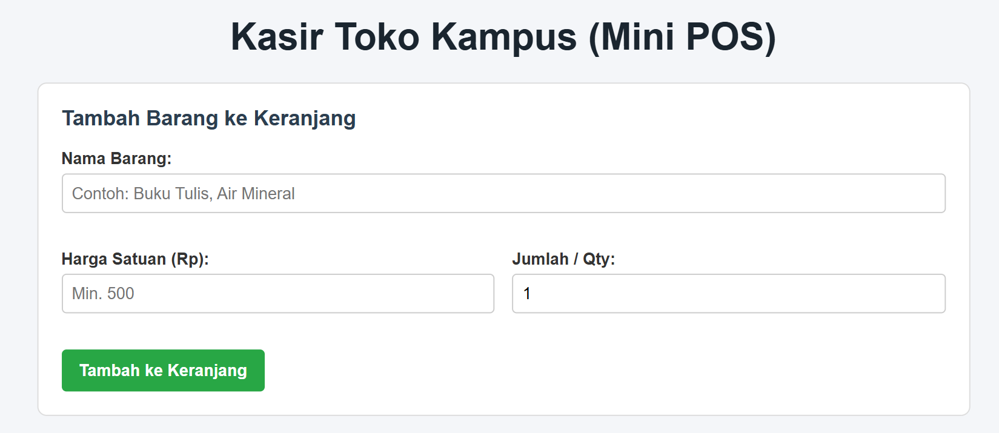
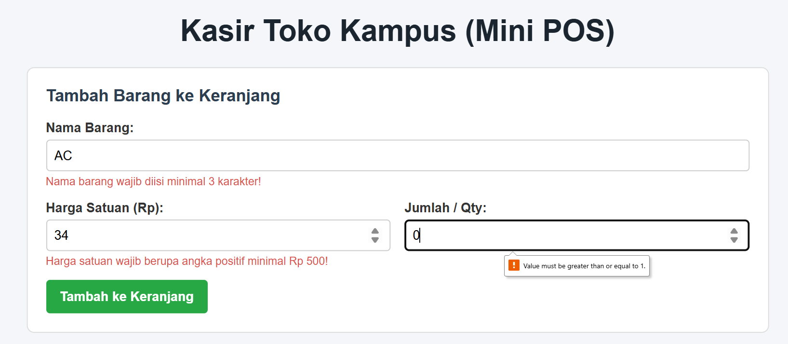
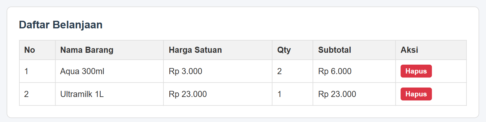
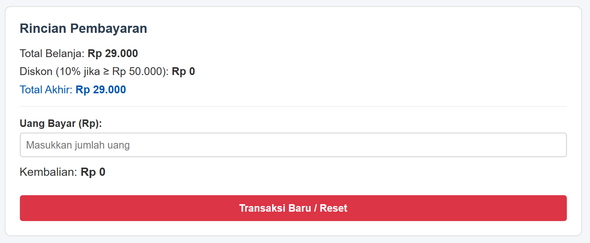

# Tugas PRAKTIKUM 1

# Identitas
- Nama:  Dimas Alhamdy
- NIM:   124140165
- KELAS: RB

# Deskripsi Aplikasi
Aplikasi ini merupakan simulasi sederhana bagaimana website dari toko kampus sederhana

# Fitur
Fitur yang dimiliki oleh website ini adalah
- [x] Validasi Form Input Barang
    - Pengecekan nama barang, harga satuan, dan jumlah barang. Error handling ketika inputan tidak valid.
- [x] Manajemen Keranjang
    - Tabel daftar belanja untuk semua barang yang valid, hapus item untuk item yang tidak jadi dibeli
- [x] Penyimpanan Data
    Pengaplikasian local storage sehingga mencegah kehilangan data meski tab tertutup ataupun ter-refresh. Pilihan transaksi baru yang menghapus data tersimpan.
- [x] Kalkulator
    - Penjumlahan total harga secara otomatis dan pengurangan dari uang yang diberikan untuk menampilkan kembalian yang harus diberikan

# Panduan Pakai
 1. Pasikan Anda memiliki semua folder dan file yang dibutuhkan 
 2. Pastikan Anda mempunyai Extension Live Server
    Jika anda tidak mempunyainya 
        1. cari tab Extension pada sebelah kiri panel
        2. Lalu cari Extension Live Server
        3. Klik Install
        4. Setelah terpasang, klik kanan pada file index.html
        5. Pilih Open With Live Server, maka browser akan otomatis terbuka

# Screenshot Tampilan
1. Tampilan Utama

2. Tampilan Error-Handling

3. Tampilan Tabel-Belanja

4. Tampilan Kalkulator dan Reset

# Penjelasan Teknis
1. Penanganan Validasi Form
    - Penggunaan Flag isValid, isValid disetel False jika salah satu pengecekan gagal dan error message akan ditampilkan "<small class="error-msg">"
2. Perhitungan Kalkulator Keuangan
    - Semua perhitungan otomatis dihitung dalam fungsi renderKeranjang() dan hitungKembalian().

3.  Persistensi Data
    - JSON.stringify mengubah array menjadi string JSON, JSON.parse membacaa string dari localstorage kembali menjadi array objek JavaScript saat halaman dimuat, localStorage.removeItem menghapus data tersimpan. 